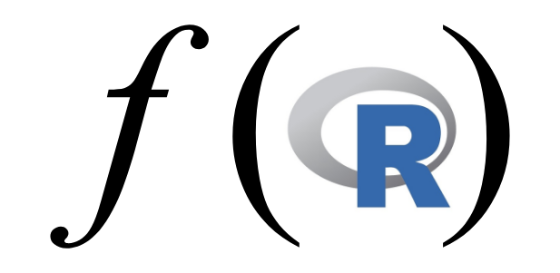
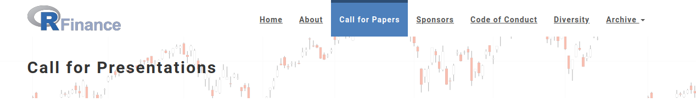
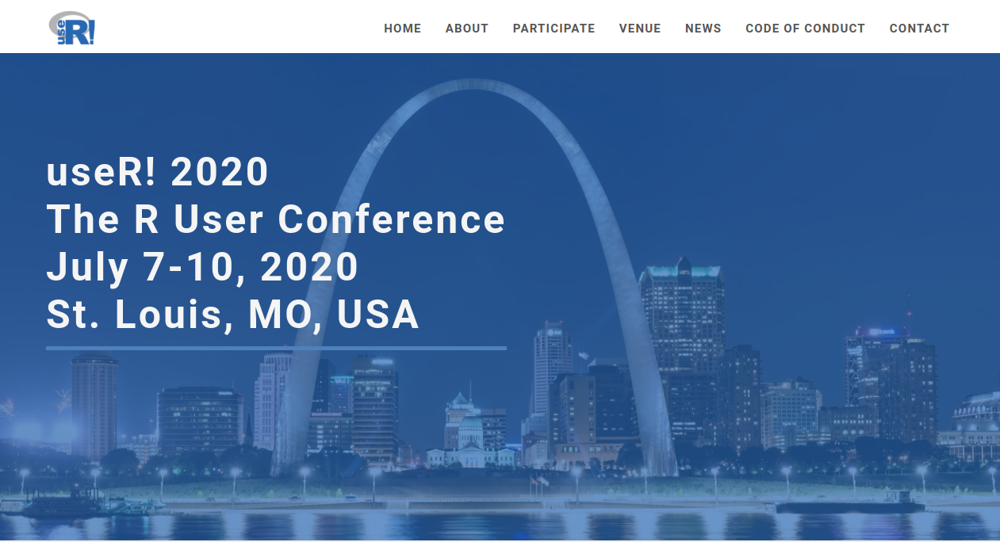
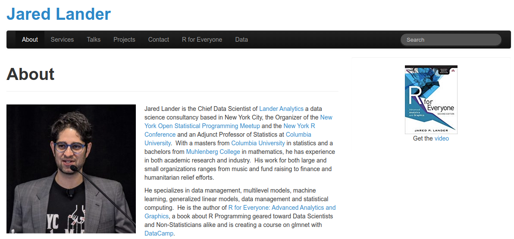
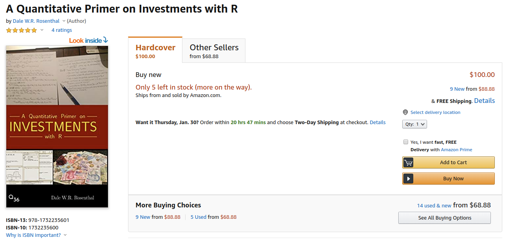
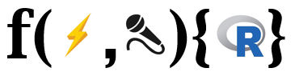

      
```{r setup, include=FALSE}
knitr::opts_chunk$set(echo = FALSE)
library(RUGtools)
```

## Chicago R User Group (CRUG) ...

- Happy New YeaR and New Decade! Welcome new and current useRs! 
- CRUG reached 3,800 members, one of largest groups in world!

    **Slack**
     
    [bit.ly/Slack-CRUG](http://bit.ly/Slack-CRUG)

    **Twitter**
    
    [ChicagoRusers](https://twitter.com/ChicagoRusers)

    **GitHub**
    
    @[Chicago-R-User-Group](https://github.com/Chicago-R-User-Group)

    **Meetup**
    
    [ChicagoRUG](https://www.meetup.com/ChicagoRUG/)
    
    **Website**
    
    [Chicago-r-user-group.github.io](https://chicago-r-user-group.github.io/)


## Who is here today?

<div style="text-align:center">


[ChicagoRUG](https://www.meetup.com/ChicagoRUG/)



[CRUG Meetup Attendance App](https://parfaitg.shinyapps.io/CRUG_Attendance_App/)
</div>

# Upcoming 2020 Conferences

## 

<div style="text-align:center"></div>

<br/>

- Founded in the fall of 2008, by a small group of open source package authors, finance industry practitioners, and finance professors.
- Single-track presentation model, tutorials, roundtable, [keynotes](https://www.rinfinance.com/about/)
- [Call for Papers](https://uic.cvent.com/events/2020-r-finance-call-for-presentations/registration-add8ccef16bc42778b301c23ccab1a9e.aspx?fqp=true). Extended Dealine: February 29 (leap year)!
- Early discounted registration will open in march

## 

<div style="text-align:center"></div>

- Main annual meeting of the R community, and attendance in 2020 is anticipated to be over 1,000 people including R developers and users.
- [Call for Abstracts](https://user2020.r-project.org/news/2019/11/20/call-for-abstracts/) Deadline: February 3!
- Early registration in February! Book your hotels ASAP! Limited in STL.
    - Call (314) 621-9600, give secret password **R foundation SLC** conference for discounted rate of $159 per night.

# Upcoming Meetup

## 

<div style="text-align:center"></div>

- Jared Lander of Landers Analytics
    - Organizer of the New York Open Statistical Programming Meetup
- Talk: "On all the ways to lasso in R"
- Date: February 19th

# Anyone hiring R folks? 

# Tonight's Sponsor

## 
<div style="text-align:center"></div>

Thanks to IBM for sponsoring food and beverages!

<div style="text-align:center"></div>

Thanks Dale Rosenthal for providing his WeWork space for tonight's meetup!

<div style="text-align:center"><a href="https://www.amazon.com/Quantitative-Primer-Investments-R/dp/1732235600"></a></div>


# Tonight's Event

## Single-Function Lightning Rounds

<div style="text-align:center"></div>

- **Charlotte Frei**: Data compression/loading algorithms with `save()`/`load()`.
- **Adam Ginesky**: 
    1. Evaluating expressions/functions with `do.call()` and `eval()`/`parse()` 
    2. Where am I? Haversine distance
- **Svetlana Levitan**: Structural Equation Modeling with `PMML`/`ONNX`
- **Dylan Stark**: Testing package functions with `testthat::with_mock()`
- **Justin Shea** - Blazing fast binary search with `data.table::setindex()`
- **Open Mic** - Any unscheduled, impromptu 5-10 minute talk on any R topic


